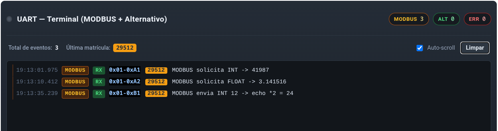

<h2 align="center">Trabalho 1 - Controle de Cruzamentos de Trânsito com Câmeras LPR</h2>
<br>

## Sumário
- [Visão geral](#visão-geral)
- [Histórico de entregas](#historico-de-entregas)
- [Como executar o projeto](#como-executar-o-projeto)
- [Desenvolvedoras](#desenvolvedoras)

## Visão geral
O projeto consiste no desenvolvimento de um sistema distribuído na Raspberry Pi para controle e monitoramento de cruzamentos de trânsito, utilizando GPIO para interação com sinais e sensores, e comunicação UART para integração com o simulador.

O sistema é composto por um Servidor Central e dois Servidores Distribuídos (um por cruzamento), todos executados como processos independentes na Raspberry Pi. O simulador do sistema de trânsito é executado em uma ESP32 em conjunto com um dashboard em tempo real (Web) que permite interação e expõe os sinais de semáforo, sensores de velocidade, botões de pedestre e câmeras LPR via GPIO e protocolo MODBUS RTU sobre RS485/UART.

A proposta completa do projeto pode ser consultada [aqui](https://gitlab.com/fse_fga/trabalhos-2026_1/trabalho-1-2026-1/-/tree/main?ref_type=heads).

## Histórico de entregas
Este repositório documenta a evolução completa do projeto.

### Entrega 1
Utilize o Dashboard (conforme a [Figura 1](https://gitlab.com/fse_fga/trabalhos-2026_1/trabalho-1-2026-1/-/blob/main/Entrega_1.md) do enunciado do trabalho - Entrega 1) para interagir com o sistema.

O programa exibirá no terminal as mudanças de estado dos semáforos e a detecção do acionamento do botão de pedestre.

### Entrega 2
O sistema pode ser controlado pelo submenu de comunicação UART, permitindo alternar entre o protocolo simplificado e o MODBUS Modificado.

Cada operação exibe na tela toda a sequência de bytes enviados e recebidos, bem como o respectivo valor decodificado. Além disso, as respostas das operações também podem ser observadas pelo Dashboard (conforme a [Figura 1](https://gitlab.com/fse_fga/trabalhos-2026_1/trabalho-1-2026-1/-/blob/main/Entrega_2.md) do enunciado do trabalho - Entrega 2).


Figura 1 - Matrícula em destaque no widget do dashboard

[**Vídeo de demonstração da execução**](./media/demonstracao-entrega2.mp4)

### Entrega 3
Para a entrega final, foram integrados os módulos das Entregas 1 e 2, além da implementação dos novos requisitos do enunciado. O sistema conta com um Servidor Central que provê um menu principal para o monitoramento geral das vias. Através dele, é possível visualizar o fluxo de tráfego (carros por minuto), a velocidade média, o total de infrações, além de permitir o controle manual dos semáforos e a ativação do modo noturno.

Para que essa integração fosse possível, foi necessário trabalhar com paralelismo. Essa arquitetura permite que o Servidor Central processe simultaneamente a recepção de dados TCP dos dois cruzamentos, a escuta de comandos via protocolo Modbus e as requisições de reconhecimento de placas (LPR).


## Como executar o projeto

### Pré-requisitos

Antes de começar, certifique-se de ter:

- Uma Raspberry Pi com o sistema operacional instalado e acesso aos pinos GPIO;
- Git instalado.

Após isso, com acesso à Raspberry Pi, clone este repositório, acesse a pasta do projeto e siga as instruções abaixo para configurar e executar o projeto.

#### 1) Instale as dependências do sistema:

```
sudo apt-get update
sudo apt-get install python3-pip python3-dev
```

#### 2) Instale a biblioteca RPi.GPIO:

```
pip install -r requirements.txt
```

### Execução

Para iniciar (os dois cruzamentos em segundo plano e o Servidor Central em primeiro plano), execute o comando abaixo na raiz do projeto:

```
python main.py 1 & python main.py 2 & python server.py
```

### Como testar as versões anteriores
O código atual na branch *master* reflete o projeto completo da entrega final. Caso deseje rodar os códigos exatamente como foram entregues nas entregas 1 ou 2, basta utilizar as tags do repositório.

Execute o comando abaixo no seu terminal, substituindo *<nome-da-tag>* pela versão desejada:

```
git checkout <nome-da-tag>
```

e depois na raiz do projeto:

```
python main.py
```

## Desenvolvedoras
<div align="center">
  <table>
    <tr>
     <td align="center">
        <a href="https://github.com/libruna">
          <br>
          <sub><b>Bruna Lima</b></sub>
        </a>
      </td>
      <td align="center">
        <a href="https://github.com/Laisczt">
          <br>
          <sub><b>Laís Soares</b></sub>
        </a>
      </td>
    </tr>
  </table>
</div>
